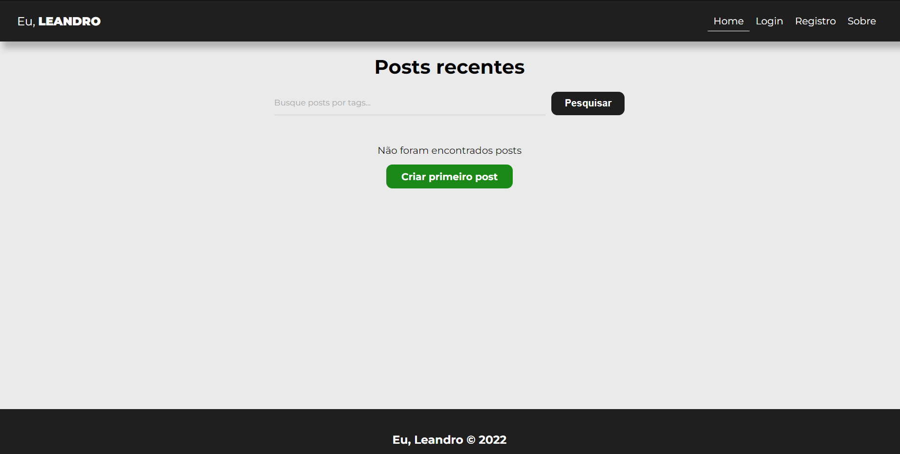
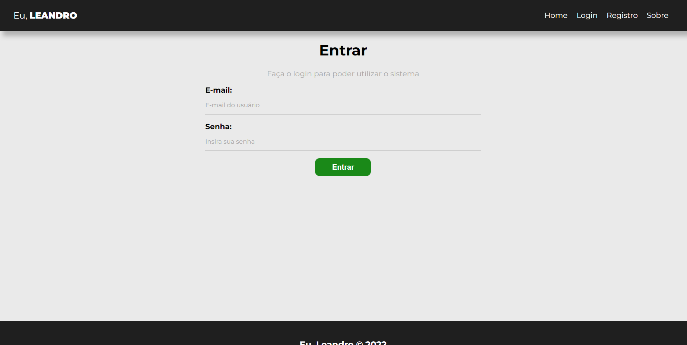
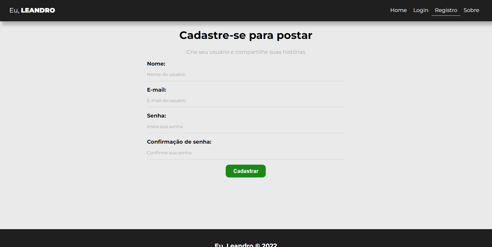
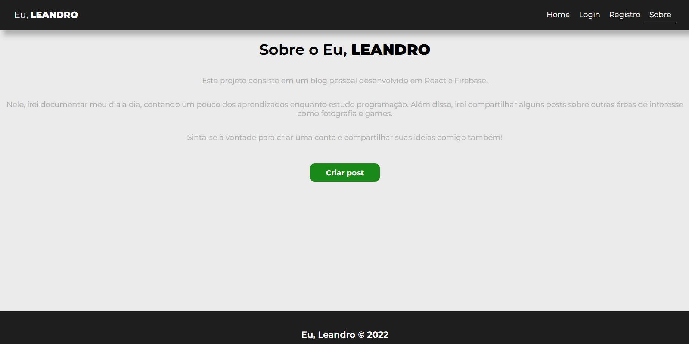
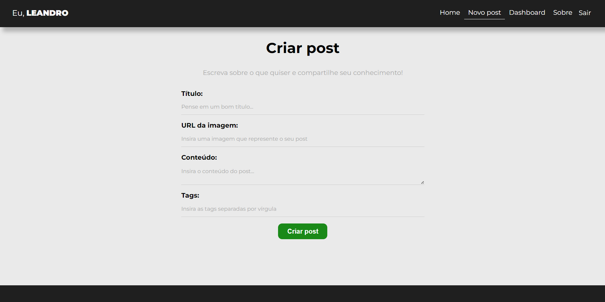
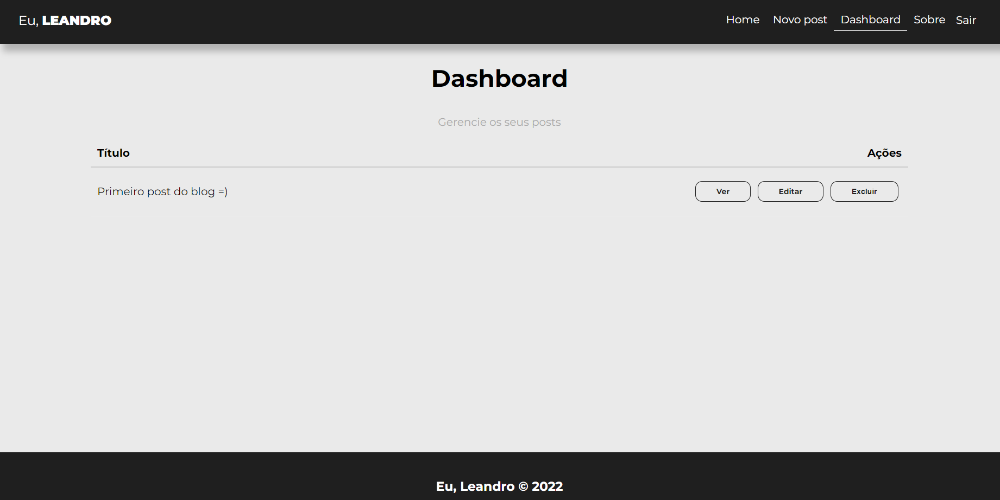

# Miniblog pessoal - Eu, Leandro

Este projeto foi desenvolvido em ReactJS e Firebase, através do curso do Professor Matheus Battisti (Hora de Codar). A proposta era a criação de um miniblog pessoal onde seria possível criar novos posts e gerenciá-los por completo, criar usuários, realizar o gerenciamento da sessão dos usuários (login e logout), dentre outras funcionalidades.

Durante o projeto foram aplicados diversos conceitos de ReactJS como por exemplo a utilização e gerenciamento de states, utilização de hooks como useEffect, useCallback, além da utilização de hooks próprios criados para o projeto. Foram aplicados conceitos de gerenciamento de dados através do Firebase.

Irei utilizar este projeto para catalogar minhas experiências na área do desenvolvimento, além de registrar novos aprendizados.

## Acesse o projeto

https://leandroteixeira97.github.io/miniblog-reactjs/

## Download e instalação do projeto local

Para rodar o projeto em uma máquina local você precisará, primeiramente, do Node instalado em seu computador (https://nodejs.org/en/).Após isto, siga os passos:

### Passo I
Realizar o seguinte comando no bash do git:

`git clone https://github.com/leandroteixeira97/miniblog-reactjs.git`

Isto realizará uma cópia local do repositório em sua máquina.

### Passo II
No diretório do projeto, dê o seguinte comando no bash para instalar todas as dependências necessárias do projeto:

 `npm install`

### Passo III
Ainda no diretório, dê o seguinte comando no bash para rodar o projeto localmente, em modo de desenvolvimento.

`npm start`

### Passo IV
Abra o link [http://localhost:3000](http://localhost:3000) para visualizar o projeto rodando no servidor local.

## Prints

### Tela Inicial

### Tela de Login

### Tela de Registro

### Tela Sobre

### Tela de Criação de Post

### Tela de Dashboard

